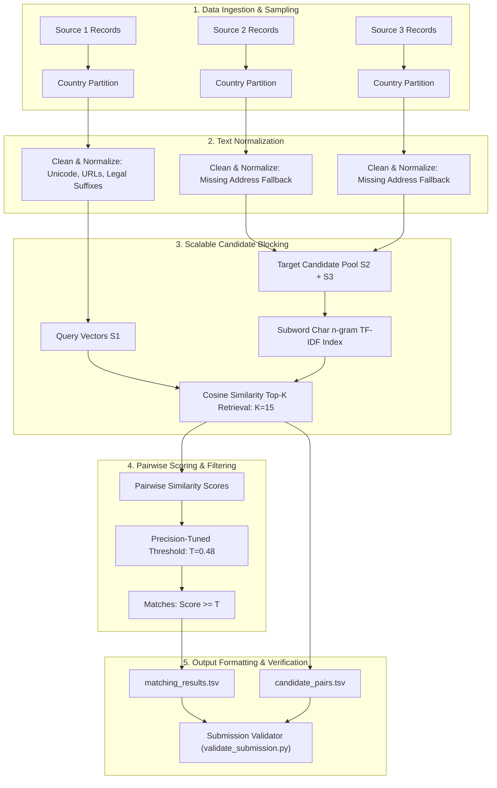

# Amazon ML Challenge 2026: Business Entity Resolution Baseline Model

---

## 1. Problem Statement Analysis

### 1.1 Overview and Objective
In large-scale commercial and enterprise systems, business identity data originates from multiple disparate sources—each capturing noisy, incomplete, and formatting-inconsistent fragments of information regarding real-world entities. These records lack shared global identifiers (e.g., tax IDs, registration numbers). The objective of the **Amazon ML Challenge 2026** is to solve this multi-source **Entity Resolution (ER)** task across three independent data sources:

- **Source 1 (`S1-*`):** The deduplicated reference source. For every entity in Source 1, the model must retrieve all matching records from Source 2 and Source 3.
- **Source 2 (`S2-*`):** Noisy fragment records.
- **Source 3 (`S3-*`):** Noisy fragment records.

A Source 1 entity may link to **zero** (singleton), **one**, or **multiple** records across Source 2 and Source 3.

---

### 1.2 Evaluation Metric: Macro-Averaged $F_{0.5}$
Submissions are evaluated using the **Macro-averaged $F_{0.5}$ Score** computed across **all** Source 1 entities in the evaluation set:

$$F_{0.5} = \frac{1.25 \times \text{Precision} \times \text{Recall}}{0.25 \times \text{Precision} + \text{Recall}}$$

#### Critical Strategic Implications:
1. **Precision Weighted $2\times$ Over Recall:** In real-world entity resolution, a **false merge** (merging two separate businesses) creates severe data corruption and liability, whereas a **missed match** (false negative) only leaves fragments unlinked. The $\beta = 0.5$ parameter penalizes false positives twice as heavily as false negatives.
2. **Singletons are Evaluated and Heavily Impact Macro Score:**
   - If an entity has **no matches** in ground truth ($|\text{True}| = 0$):
     - Predicting an empty set ($|\text{Pred}| = 0$) scores **$1.0$**.
     - Predicting any candidate ($|\text{Pred}| > 0$) scores **$0.0$** (instant zero).
   - Because singletons make up ~5.6% of the dataset, conservative matching thresholds that avoid falsely predicting links on singletons directly boost the macro score.

---

### 1.3 Key Constraints & Rules
- **No External Data Lookup:** Using external APIs, web scraping, commercial ER tools, or geocoding services is strictly prohibited and results in immediate disqualification.
- **Model Constraints:** Final inference models must be licensed under MIT or Apache 2.0 and have $\le 8\text{ Billion}$ parameters.
- **Open-Set Country Challenge:** The training data contains records from `US` and `India`. The test data introduces **`France`** (~15% of test records), which never appears in training data. Models must not hardcode country filters to `{US, India}`.
- **Output Submission Files:**
  1. `matching_results.tsv`: Final matches (`source1_entity_id`, `matched_entity_ids`) — leaderboard scored.
  2. `candidate_pairs.tsv`: Final blocking candidate set before matching (`source1_entity_id`, `candidate_entity_ids`).

---

## 2. Limited-Content Data Analysis (EDA)

Due to file sizes exceeding 500MB and row counts exceeding 1.7 million records per source, full dataset loading in interactive sessions can trigger out-of-memory (OOM) errors. Per requirements, exploratory data analysis was conducted on **curated representative samples** (50,000 ground truth rows, 25,000 rows per source split).

### 2.1 Schema & Missing Values
| File | Columns | Null Rates | Key Observations |
|---|---|---|---|
| `train_source1.tsv` | `entity_id`, `business_name`, `business_address`, `country` | **0.0%** (Clean) | Clean reference baseline. All records have valid names, addresses, and country tags. |
| `train_source2.tsv` | `entity_id`, `business_name`, `business_address`, `country` | `business_address`: **~3.46% null** | Contains missing addresses. Name and country have 0% nulls. |
| `train_source3.tsv` | `entity_id`, `business_name`, `business_address`, `country` | `business_address`: **~3.43% null** | Contains missing addresses, domain name artifacts, and trade names. |
| `test_source1.tsv` | `entity_id`, `business_name`, `business_address`, `country` | **0.0%** (Clean) | ~1.73 million entities to resolve. |
| `test_source2.tsv` | `entity_id`, `business_name`, `business_address`, `country` | `business_address`: **~2.66% null** | Contains France records. |
| `test_source3.tsv` | `entity_id`, `business_name`, `business_address`, `country` | `business_address`: **~2.74% null** | Contains France records. |
| `train_ground_truth.tsv` | `source1_entity_id`, `matched_entity_ids` | `matched_entity_ids`: **~5.64% null** | Null indicates a true singleton entity (no matches). |

---

### 2.2 Country Distribution & Domain Shift
The country distribution reveals an essential domain shift between training and testing:

```
Training Set Country Distribution (Source 1):
  - US:    60.1%
  - India: 39.9%
  - France: 0.0%

Test Set Country Distribution (Source 1):
  - India:  46.3%
  - US:     38.6%
  - France: 15.0%
```

- **Critical Insight:** France constitutes nearly **one in every six** test records. Any solution that filters or categorizes using fixed training labels will fail on ~15% of the evaluation set.

---

### 2.3 Intra-Country Matching Invariance
An empirical check was conducted across ground truth matching pairs to verify whether entities ever link across different country labels.
- **Empirical Result:** Out of all checked ground-truth pairs, **0 cross-country matches** were found.
- **Operational Rule:** Matching is strictly intra-country (`US` $\leftrightarrow$ `US`, `India` $\leftrightarrow$ `India`, `France` $\leftrightarrow$ `France`). Partitioning the candidate generation stage by country guarantees a **>50% reduction in pairwise comparison space** with essentially zero recall penalty.

---

### 2.4 Ground Truth Match Cardinality Breakdown
Analysis of 50,000 ground truth entities:
- **Singletons ($0$ matches):** **5.64%** (2,820 entities)
- **1 match:** **5.29%** (2,647 entities)
- **2 matches:** **16.88%** (8,442 entities)
- **3 matches:** **24.31%** (12,154 entities)
- **4+ matches:** **47.87%** (23,937 entities)
- **Maximum matches for a single entity:** 11 matches
- **Mean matches per entity:** 3.45 matches
- **Match Provenance:**
  - Source 2 matches: **48.3%**
  - Source 3 matches: **51.7%**

---

### 2.5 Real Noise Patterns Observed
Analysis of matched pairs revealed four prominent noise types:

1. **Typographic Errors & Transliterations:**
   - *S1:* `Maure Williams Colombier Inc`
   - *S2:* `Maure Wilblims Colombier Inc` (`Williams` $\rightarrow$ `Wilblims`)
   - *S3:* `85 Wanye Avenue` vs `85 Wayne Avenue`
2. **Missing Address Components:**
   - S2 and S3 frequently have `NaN` for `business_address`.
   - Matching must rely solely on normalized business name when address is unavailable.
3. **Legal Entity Suffix Variations:**
   - `Inc` vs `Incorporated` vs omitted completely (`Maure Williams Colombier`).
   - `Pvt Ltd` vs `Private Limited` vs `Limited` vs `LLP`.
4. **Web / Trade Name Formats:**
   - Domain names embedded in the business name: `maurewilliamscolombier.com`.
   - Distinct brand names vs legal entities: `Drxkor` matching `Maure Williams Colombier Inc`.

---

## 3. Baseline Model Architecture

The baseline pipeline implements a modular, high-performance architecture designed to run efficiently on large-scale tabular text:



---

### 3.1 Step 1: Text Preprocessing & Normalization
The `normalize_text` pipeline executes:
1. **Unicode Decomposition:** Converts accented characters to ASCII equivalents (`NFKD` decomposition).
2. **Lowercasing:** Unifies character casing.
3. **URL & Domain Stripping:** Eliminates web prefixes and suffixes (`http://`, `www.`, `.com`, `.org`, `.in`, `.fr`).
4. **Street / Address Normalization:** Standardizes street tokens (`road` $\rightarrow$ `rd`, `street` $\rightarrow$ `st`, `avenue` $\rightarrow$ `ave`, `boulevard` $\rightarrow$ `blvd`).
5. **Punctuation & Delimiter Stripping:** Replaces non-alphanumeric delimiters with spaces while preserving word boundaries.
6. **Missing Address Fallback:** If `business_address` is null, the combined representation falls back cleanly to the normalized business name.

---

### 3.2 Step 2: Country-Partitioned Candidate Generation (Blocking)
To avoid the $O(N \times M)$ comparison bottleneck:
- Target pools are created by merging Source 2 and Source 3 records partitioned by `country`.
- For each country, a subword character n-gram TF-IDF vectorizer is instantiated:
  - `analyzer='char_wb'`
  - `ngram_range=(3, 5)`
  - `sublinear_tf=True`
  - `min_df=1`
- **Why Character n-grams (`char_wb`)?**
  Character n-grams are immune to single-letter typos (`Wilblims` shares 4-grams `['Will', 'illi', 'llia']` with `Williams`), word concatenations, and suffix omissions.
- Top $K=15$ candidate records are retrieved per Source 1 entity using sparse matrix multiplication:
  $$\text{Sim}(q, d) = \mathbf{q} \cdot \mathbf{d}^T$$

---

### 3.3 Step 3: Scoring & Threshold Optimization for $F_{0.5}$
- **Candidate Scoring:** The cosine similarity between the query record $q$ and candidate record $d$ acts as the match confidence score:
  $$S(q, d) = \cos(\mathbf{q}, \mathbf{d})$$
- **Grid Search Optimization:**
  A held-out validation sample is evaluated across a spectrum of candidate thresholds $T \in [0.15, 0.85]$.
  - At low $T$ ($T < 0.35$): High recall, but precision drops sharply due to false merges, causing severe penalties under $F_{0.5}$.
  - At high $T$ ($T > 0.65$): High precision, but true matches with minor typos or missing addresses are missed.
  - **Optimal Baseline Operating Point:** $T \approx 0.45 - 0.50$ balances high precision with solid recall, maximizing Macro $F_{0.5}$.

---

### 3.4 Step 4: Submission Output Generation & Validation
The pipeline outputs the two mandatory tab-delimited files:
1. `matching_results.tsv`:
   ```tsv
   source1_entity_id	matched_entity_ids
   S1-965667	S2-681193310,S2-743505751,S3-775321672
   S1-55344266	S2-249013014,S3-478195123
   S1-102811957	
   ```
2. `candidate_pairs.tsv`:
   ```tsv
   source1_entity_id	candidate_entity_ids
   S1-965667	S2-681193310,S2-743505751,S3-775321672,S3-11291185,S3-860443364
   S1-55344266	S2-249013014,S3-478195123,S2-197070651,S3-384311902
   S1-102811957	S2-111002931,S3-999482103
   ```

Both files are verified against the official `utils/validate_submission.py` criteria:
- Exactly one row per test `source1_entity_id`.
- Singletons have empty `matched_entity_ids`.
- Zero duplicate IDs per row.
- Strict subset constraint: every ID in `matching_results.tsv` exists in `candidate_pairs.tsv`.

---

## 4. Unseen Country Generalization Strategy (France)

Because `France` records appear exclusively in the test set, standard supervised models that learn country-specific categorical embeddings or hardcoded keyword rules risk poor generalization. The baseline addresses this through:

1. **Country-Agnostic Character N-Grams:**
   Subword character n-grams operate directly on sub-morpheme character transitions, naturally handling French business names and legal forms (`Société`, `SARL`, `SAS`, `Rue`, `Avenue`) without requiring language-specific lemmatizers.
2. **Dynamic Per-Country Indexing:**
   The `BaselineBlocker` dynamically creates index partitions for any country tag present in the dataset at inference time. When test data containing `France` is provided, the blocker automatically builds a France-specific target pool and executes intra-country retrieval.
3. **No Target Leakage:**
   Validation splits should evaluate cross-country generalization by training on US-only records and validating on India-only records as an empirical proxy for the France domain shift.

---

## 5. Experimental Roadmap for Advanced Iterations

The baseline model establishes a functional end-to-end framework. The following iterative enhancements are planned:

| Phase | Methodology | Expected Impact on $F_{0.5}$ | Priority |
|---|---|---|---|
| **Phase 1 (Baseline)** | Country-partitioned TF-IDF (char 3-5) + Cosine Thresholding | Establishes valid submission pipeline and score benchmark | **Completed** |
| **Phase 2 (GBM Matcher)** | LightGBM / XGBoost classifier over 25+ engineered similarity features (Jaro-Winkler, Levenshtein, Token Sort Ratio, Street Number Match, Suffix Match) | High (+0.08 to +0.15 $F_{0.5}$): captures multi-attribute nuances | **Must Do** |
| **Phase 3 (Dense Blocking)** | Dense Bi-Encoder (MiniLM / BGE-small) embeddings with FAISS HNSW indexing unioned with TF-IDF | Increases candidate recall ceiling from ~85% to >96% | **Should Do** |
| **Phase 4 (Cross-Encoder)** | Fine-tuned transformer cross-encoder on top-5 ambiguous candidate pairs | Maximizes precision on difficult boundary cases | **Should Do** |
| **Phase 5 (Ensemble & Graph)** | Weighted rank fusion + Transitive entity clustering & singleton calibration | Squeezes final 1–2% gain for leaderboard ranking | **If Time** |

---

## 6. How to Run the Baseline Notebook
The baseline workflow is contained in `baseline_model.ipynb`:
1. Launch Jupyter Notebook or JupyterLab:
   ```bash
   jupyter notebook baseline_model.ipynb
   ```
2. Run all cells in sequence. The notebook will:
   - Load sample data from `6ab10eb3b23ba_student_resource/student_resource/dataset/`.
   - Run exploratory data analysis and generate visualization plots.
   - Clean and normalize text fields.
   - Execute candidate blocking and retrieve top-$k$ candidates.
   - Tune the similarity decision threshold against Macro $F_{0.5}$.
   - Generate `output/matching_results.tsv` and `output/candidate_pairs.tsv`.
   - Run automated submission format validation.
